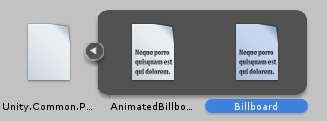
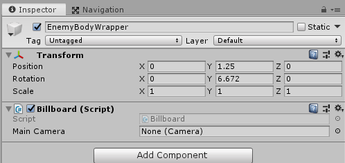

# Unity.Common

A source of common libraries developed for use in Unity projects.

## Usage

1. Update the project files' `OSInstallRoot` and `UnityVersion` properties to target the correct Unity installation on your machine. See the [Unity3D NuGet Package Readme](https://github.com/DerploidEntertainment/UnityAssemblies) for more.

    ```xml
    <Project Sdk="Microsoft.NET.Sdk">
        <PropertyGroup>
            <TargetFramework>netstandard2.0</TargetFramework>
            <OSInstallRoot>C:\Program Files</OSInstallRoot>
            <UnityVersion>2019.1.5f1</UnityVersion>
            <!-- ... -->
        </PropertyGroup>
    </Project>
    ```

1. Build the project(s) in Visual Studio or by using the command `dotnet build -c Release` from each desired project directory or from the solution's directory to build all projects at once.

1. Copy the generated .dll file(s) from each project's `bin\Release\netstandard2.0\` directory and paste (or drag-drop) them into the Assets folder in an open Unity project. You will now see it as an imported asset, with any available scripts visible from the expanded arrow view.

    

1. Use the asset as normal. Assets that inherit from MonoBehavior can be added to a GameObject, just like any MonoBehavior class script.

    

## Thanks

- Thanks to [Derploid Entertainment](https://github.com/DerploidEntertainment) for making the fantastic [Unity3D Assembly NuGet Package](https://github.com/DerploidEntertainment/UnityAssemblies).
- Thanks to [richardschembri](https://github.com/richardschembri) for the [Doom-Style Animated Billboard](https://www.reddit.com/r/Unity3D/comments/8xjvp3/doom_style_animated_billboard/) code.
